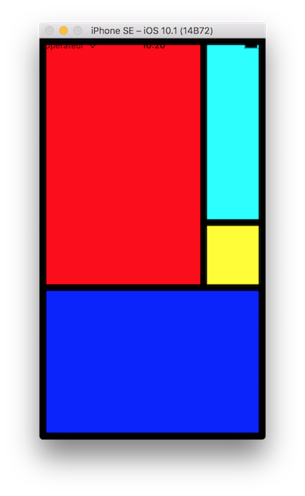
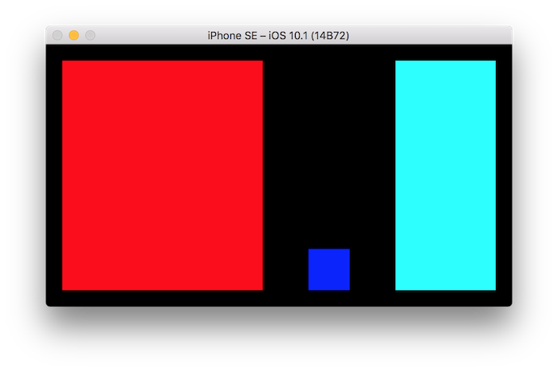

# Grid layout

A Xamarin grid helper layout that uses C# operator override. 

## Getting started

Let's start with a common example with a simple layout that changes while in landscape.





```csharp
var red = new UIView { BackgroundColor = UIColor.Red };
var blue = new UIView { BackgroundColor = UIColor.Blue, Frame = new CGRect(0,0,50,50) };
var cyan = new UIView { BackgroundColor = UIColor.Cyan };
var yellow = new UIView { BackgroundColor = UIColor.Yellow };

var portrait = new Grid.Layout() 
					 { 
						Spacing = 10, 
						Padding = new Grid.Insets(10) 
					 }
					 .WithRows(0.75f, 0.25f, 200f)
					 .WithColumns(0.75f, 0.25f)
					 + red.At(0, 0).Span(2, 1) 
				  	 + blue.At(2, 0).Span(1, 2) 
					 + cyan.At(0, 1) 
					 + yellow.At(1,1);

var landscape = new Grid.Layout() 
					 { 
					 	Spacing = 20, 
						Padding = new Grid.Insets(20), 
					 }
					 .WithRows(1.00f)
					 .WithColumns(0.50f, 0.25f, 0.25f)
					 + red.At(0, 0)
					 + blue.At(0, 1)
					       .Vertically(Grid.Layout.Alignment.End)
					       .Horizontally(Grid.Layout.Alignment.Center)
					 + cyan.At(0, 2);

var grid = new Grid();

grid.AddLayout(portrait);
grid.AddLayout(landscape, (g) => (g.Frame.Width > g.Frame.Height));

this.View = grid;
```

## Usage

The getting started example should be self-explanatory but find here a more in-depth presentation.

### Grid

A grid is the root `UIView` that displays its subviews thanks to its current layout. Each of its layout has a `Trigger` property : the grid will choose the first declared layout that match when update.

By default, the layout update is triggered when the grid size change, but you can force a new layout (for example if your triggers depends on other factors) by calling `UpdateLayout()`.

### Layout

A layout contains row and column definitions (*number*, *size*), but also the position of each subview (`Cell`).

#### Padding

A global padding space inside your grid could be defined.

**Example:**

```csharp
// left, top, right, bottom
layout.Padding = new Grid.Insets(10,20,10,5);
```

#### Spacing

The spacing property defines the spacing between each row or column.

**Example:**

```csharp
layout.Spacing = 10;
```

#### Column and row definitions

To define the columns and rows, use the `WithRows/WithColumns(params float[] rows)` method. Each entry adds a row/column with the value as size.

If `size > 1`, the value is considered as an absolute size.

If `size <= 1`, the value will use the amount of the remaining space (after removing other absolute row/column sizes and spacings).

**Example:**

```csharp
layout.WithRows(0.5f,100.0f,0.25f,0.25f);
```

#### Creating cells

For adding cells, extension methods are available for `UIView`.

##### At(int row, int column)

Must be the first declaration and indicates the top-left position of the cell.

##### Span(int rows, int columns)

Indicates the size of the cell (default : `(1,1)`).

##### Vertically(Grid.Layout.Alignment alignment)

Indicates the vertical position of the view in the cell (default : `Stretched`).

##### Horizontally(Grid.Layout.Alignment alignment)

Indicates the horizontal position of the view in the cell (default : `Stretched`).

**Example:**

```csharp
var cell = subview.At(0, 1)
       .Span(1,2)
       .Vertically(Grid.Layout.Alignment.End)
       .Horizontally(Grid.Layout.Alignment.Center)
```

#### Adding cells to the layout

The easiest and recommanded way is to use the `+` operator override onto your layout to append new cells.

**Example:**

```csharp
layout = layout + cell1 + cell2;
```

#### Adding default layout

To add your layout to your grid, use the `Grid.AddLayout(Grid.Layout layout)` method.

**Example:**

```csharp
grid.AddLayout(layout)
```

#### Adding triggered layouts

The current selected layout of your grid can dynamically changed if you have more than one layout. In this case, you have to associate triggers to each other layout, to allow the view to be able to choose the right layout at a given time.

To achieve this, add the other layouts with the `Grid.AddLayout(Grid.Layout layout, Func<Grid,bool> trigger)` method.

**Example:**

```csharp
grid.AddLayout(layout2, (grid) => grid.Frame.Width > grid.Frame.Height);
```

## Q&A

#### What if I want different spacing between rows/columns ?

Simply use a spacing of `0` and add empty rows/columns with a fixed size.

## About

This layout system is vastly inspired by Windows (WPF, WinRT) and Xamarin.Forms Grid components.

You might be wondering why I'm doing this while there's already existing layout mecanisms :

- *IMO* `UIStackView`, contraints, autoresizing masks are too verbose for creating common layouts from code, in particular with purely dynamic layouts. I'm not a real fan of Storyboard constraints too to be honest. Just wonder of the number of lines of code/storyboard declarations needed to implement the simple getting started example that takes just a few lines of code ...
- I also wanted to have fluent apis and to take advantage of C# operator override to have concise layout declarations.
- Having a simple unified layout API on all platforms is also a motivation.

## Roadmap

- [X] iOS Implementation
- [ ] Android Implementation
- [ ] Optimize and benchmarking

## Contributions

Contributions are welcome! If you find a bug please report it and if you want a feature please report it.

If you want to contribute code please file an issue and create a branch off of the current dev branch and file a pull request.

### License

MIT © [Aloïs Deniel](http://aloisdeniel.github.io)